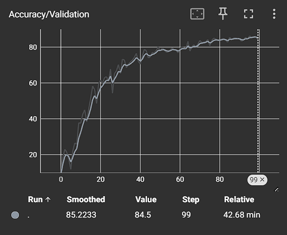
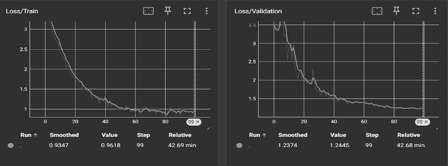
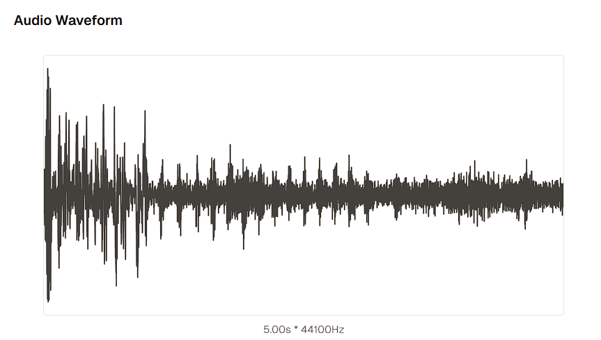
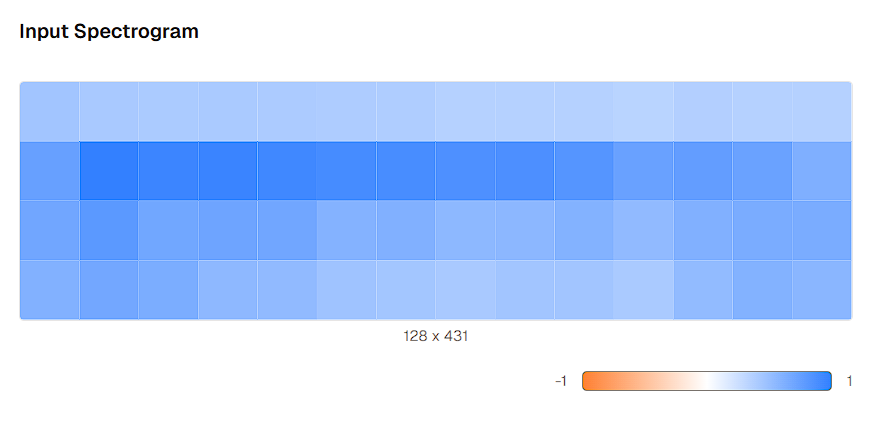
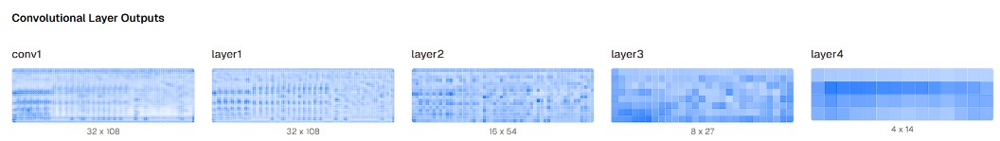

## 📌 Overview

Environmental Sound Classification (ESC) is a challenging task due to the complex temporal and spectral nature of real-world audio. This project proposes a **Residual CNN-based deep learning framework** that not only achieves high classification accuracy but also provides **interpretability through intermediate feature map visualization**.

## Key Results

| Model        | Accuracy |
|--------------|----------|
| SVM Baseline | 62.0%    |
| Proposed CNN | **84.5%**|

---

## Features

- Residual CNN architecture with skip connections
- Mel-spectrogram-based audio preprocessing
- Advanced training: mixup augmentation, time-frequency masking, label smoothing, OneCycle LR scheduling
- Intermediate feature map visualization for model interpretability
- Comparative analysis with SVM baseline

## 🗂️ Dataset

**[ESC-50](https://github.com/karolpiczak/ESC-50)** — A benchmark dataset for environmental sound classification.

| Property       | Value          |
|----------------|----------------|
| Total Samples  | 2,000          |
| Classes        | 50             |
| Samples/Class  | 40             |
| Clip Duration  | 5 seconds      |
| CV Folds       | 5              |

> 4 folds used for training, 1 fold held out for testing (standard protocol).

---

## ⚙️ Training Configuration

| Hyperparameter       | Value               |
|----------------------|---------------------|
| Optimizer            | AdamW               |
| LR Schedule          | OneCycle            |
| Max Learning Rate    | 0.002               |
| Epochs               | 100                 |
| Batch Size           | 32                  |
| Label Smoothing      | 0.1                 |
| Augmentation         | Mixup + SpecAugment |

---

## 🔬 Key Techniques

### 🎵 Audio Preprocessing
- Resampled to **22,050 Hz**, converted to mono
- **128 Mel filter banks** via STFT
- Amplitude-to-dB conversion for log-scaled spectrograms

### 📈 Data Augmentation
- **Time Masking** — randomly zeros out time segments
- **Frequency Masking** — randomly zeros out frequency bands
- **Mixup** — linearly blends pairs of samples and labels

### 🧠 Interpretability
Feature maps are extracted from each convolutional layer to visualize:
- **Early layers** → basic frequency and edge patterns
- **Middle layers** → temporal structure and transitions
- **Deep layers** → abstract, class-discriminative representations
---

## Requirements

pip install torch torchaudio librosa numpy matplotlib scikit-learn

## 📊 Results

## 🎵 Audio Preprocessing

## 🧠 Feature Maps

